# PyTorch Memory Forensics: Extracting Convolutional Neural Networks from RAM

## Overview
 We will walk through how to extract a PyTorch convolutional neural network (CNN) directly from volatile memory on Linux. We're going to dive deep into the C++ LibTorch backend, map out its in-memory data structures using GDB, and then build a custom Volatility 3 plugin to automate the recovery of the model's architecture, weights, and forward-pass execution logic.

> **Environment Note:**
> The memory forensics environment consisted of an Ubuntu Server 22.04 guest virtual machine running on a VirtualBox laptop host. The specific system and software configurations included:
> * **Kernel:** Linux kernel version 5.15.0-198-generic
> * **Hardware Allocation:** 9821 MB of guest RAM and a 30 GB virtual disk (`/dev/sda2`)
> * **Software Stack:** Python 3.10 (running in a local virtual environment), PyTorch version 2.14.1+cpu, and the Volatility 3 Framework version 2.28.2

## 1. Model Training and C++ Export
First things first, we need to train a custom CNN on the CIFAR-10 dataset using PyTorch and export it so we can run it in C++. We will follow these guides [PyTorch 60-Minute Blitz](https://pytorch.org/tutorials/beginner/deep_learning_60min_blitz.html) and the [PyTorch C++ Export Guide](https://h-huang.github.io/tutorials/advanced/cpp_export.html) for the basics.

1. **Load the dataset:** Use the `torchvision.datasets.CIFAR10` module to download and load the image arrays into memory.
2. **Train the model:** Run the training script to partition the CIFAR-10 data into 48,000 training, 6,000 validation, and 6,000 test samples. Save the final trained model state dictionary to `models/cifar10_custom_cnn.pt`.
3. **Export to TorchScript:** Run `export_torchscript.py` to trace the model execution graph. This step serializes the architecture and weights into `models/cifar10_traced_model.pt`, preparing it for loading into the LibTorch C++ executable.

<p align="center">
  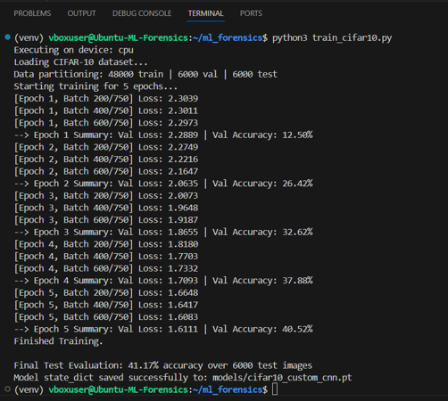
  <br>
  <em>Training the custom CNN on the CIFAR-10 dataset.</em>
</p>

<p align="center">
  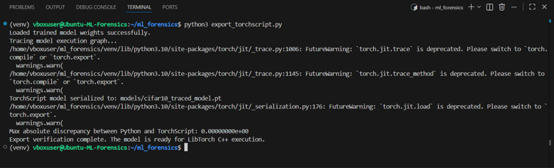
  <br>
  <em>Exporting the model architecture and weights to TorchScript.</em>
</p>

## 2. C++ Compilation and Inference Setup
We need to compile a C++ inference program (`cifar_inference`) using the LibTorch API to run our exported model. This sets up a realistic environment while keeping the memory structures intact so we can analyze them later.

When our C++ app (`main.cpp`) runs, it handles two main memory allocations:
* **Model Loading:** Uses `torch::jit::load` to parse the serialized `.pt` file and allocate the computational graph and model weights directly onto the process heap.
* **Input Data:** Uses `torch::from_blob` to load a contiguous buffer of test images into memory, providing real input tensors for the model to process.

### Compiler Optimization and Debug Flags
When configuring the CMake build, apply specific compiler flags to ensure the resulting binary is suitable for memory forensics and debugging:
* `-O0`: Disables compiler optimizations so variables and pointers remain resident in memory and are not optimized away into registers.
* `-g3`: Embeds maximum debugging information (macros and symbols) into the binary, allowing GDB to map memory addresses back to C++ data structures.
* `-fno-omit-frame-pointer`: Forces the compiler to keep the frame pointer in a register, preserving the stack layout for accurate backtraces and memory inspection.

## 3. Dynamic Memory Analysis with GDB

Before we can rip a neural network from a flat memory dump, we need to map out exactly how the LibTorch C++ backend structures its objects in the heap. We'll use [GDB](https://darkdust.net/files/GDB%20Cheat%20Sheet.pdf) for some dynamic analysis. The goal here is **not** to extract the weights using GDB, but to figure out the exact hexadecimal pointer offsets we'll need later to automate the extraction using [Volatility](https://volatility3.readthedocs.io/en/latest/index.html).

### LibTorch Tensor Memory Layout
Under the hood, LibTorch separates tensor metadata from the physical data. A tensor in memory actually consists of three hierarchical C++ heap structures:
1. **Metadata (`c10::TensorImpl`):** Stores structural dimensions (`sizes`), memory layout (`strides`), and data types.
2. **Storage Manager (`c10::StorageImpl`):** Manages element counts (`numel`) and holds the core pointer (`data_ptr_`) to the actual values.
3. **Raw Payload Buffer:** The contiguous block of heap memory containing the raw IEEE 754 floating-point data.

<p align="center">
  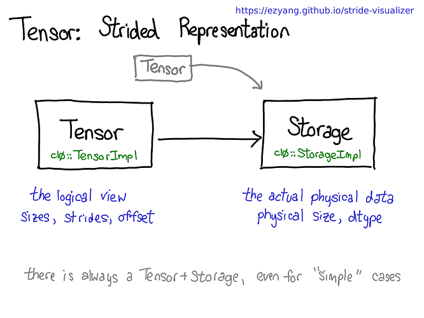
  <br>
  <em>Logical vs. physical representation of a LibTorch Tensor.</em>
</p>

### Process Freezing and Pointer Traversal
Start the compiled binary in GDB and set a breakpoint at `main.cpp:60` (`at::Tensor output = module.forward(inputs).toTensor();`). This freezes the process at the exact moment the input images and model weights are fully resident in the process heap. 

Once paused, run `info proc` to grab the process ID (PID) of the frozen execution, which will be used for the Volatility RAM dump later.

<p align="center">
  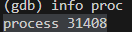
  <br>
  <em>PID of the frozen C++ inference process.</em>
</p>

#### 1. Verifying the Tensor Memory Structure
Instead of relying on high-level variable names (which are often stripped or optimized away in a raw RAM dump), we use GDB to evaluate the base variable, grab its raw hexadecimal heap address, and manually inspect the memory offsets.

*   **Locate the Base Address:** Run `print input_tensor` to retrieve the underlying heap address of the `c10::TensorImpl` object (e.g., `0x5555589b7d90`).
*   **Traverse to Storage Manager:** Using GDB's memory examination, inspect the hex address (`x/16a 0x5555589b7d90`). We discovered that the pointer to the `StorageImpl` manager is consistently located at offset `+0x10`.
*   **Locate the Raw Payload:** Inspecting the `StorageImpl` hex address (`x/8a <storage_impl_address>`) reveals the base address of the contiguous data buffer allocated for the batch.
*   **Verify the Data:** Run `x/16f <buffer_address>` to print the floats. This proves we have correctly mapped the path to the raw tensor data.

<p align="center">
  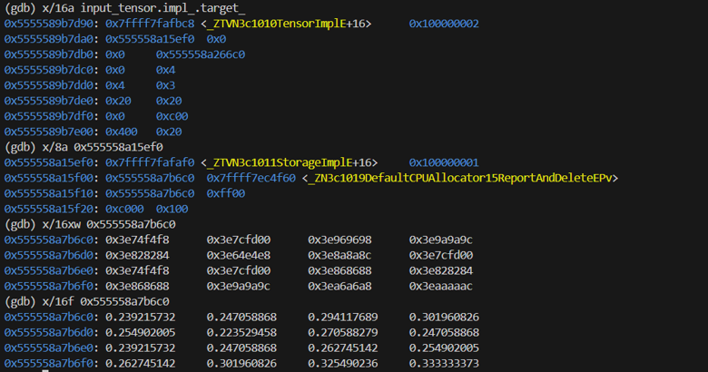
  <br>
  <em>Using explicit hex addresses to traverse from c10::TensorImpl to the raw floating-point buffer.</em>
</p>

#### 2. Mapping the Model Architecture Offsets
The model architecture is stored as a nested tree of submodules (layers). We traverse this tree using the exact same offset logic to prove the entire architecture is predictably laid out in the heap. Using GDB, we manually walked through the memory structure by chaining memory examination (`x/`) commands to uncover the layer hierarchy.

The manual GDB traversal follows this sequence to find the `conv1` weights:
1.  **`print module`**: Acts as the entry point into investigating the neural network, providing the root virtual address.
2.  **`x/12a <module_address>`**: Investigates the root model's memory location to locate the `slots_` array pointer at offset `+0x50`.
3.  **`x/16a <slots_array_address>`**: Inspects the 128-byte buffer holding the root module's 8 attribute slots.
4.  **`x/4a <slot_2_address>`**: Dives into Slot 2 to investigate the `conv1` submodule.
5.  **`x/4a <conv1_slots_address>`**: Dives into the `conv1` slots array to locate the `conv1.weight` `TensorImpl` pointer.

<p align="center">
  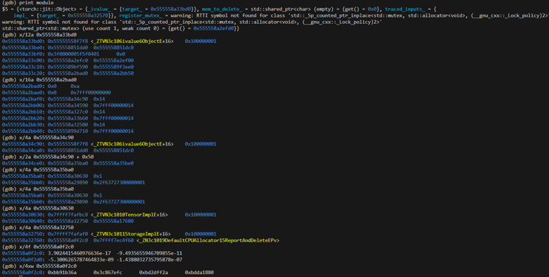
  <br>
  <em>Raw GDB terminal output tracing the hex addresses from the root neural network module down to the conv1 layer offsets.</em>
</p>

By tracking these offsets, we successfully mapped the logical levels of the C++ objects to their physical heap implementations:

<p align="center">
  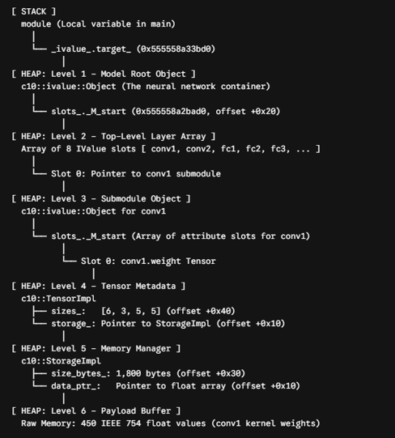
  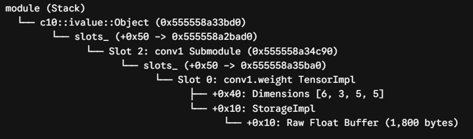
  <br>
  <em>The hierarchical heap layout of the LibTorch model architecture. Gemini was used to create this visualization structure based on the raw GDB memory output.</em>
</p>

## 4. Memory Acquisition with LiME

While the inference process is paused in GDB, we capture a complete snapshot of the system's physical RAM to preserve the exact state of the heap. We use the [Linux Memory Extractor (LiME)](https://github.com/jtsylve/LiME) kernel module for this acquisition. 

Before executing the capture, we must confirm two things: first, that the process is completely stopped by the debugger (indicated by `STAT = t`), and second, that the system has sufficient free disk space to store the entire RAM footprint (e.g., >10GB) to prevent truncated and corrupted dumps. We also explicitly use `format=lime` during the capture; unlike a raw format, this preserves the physical address holes present in a VirtualBox guest, which Volatility requires to properly translate memory addresses. Finally, we verify the integrity of the completed dump by checking the file header for the LiME magic number (`EMiL`).

```bash
# 1. Verify the process is paused in GDB (look for STAT 't')
ps -o pid,ppid,stat,comm -p 31408
# 2. Check for sufficient disk space (must exceed total guest RAM)
df -h / | tail -1
# 3. Capture RAM using the LiME module
sudo insmod LiME/src/lime-$(uname -r).ko "path=/home/vboxuser/ml_forensics/lime_dump/new.lime format=lime"
# 4. Adjust file ownership
sudo chown vboxuser:vboxuser /home/vboxuser/ml_forensics/lime_dump/new.lime
# 5. Verify the dump integrity by checking for the 'EMiL' (454d 694c) magic number
head -c 4 /home/vboxuser/ml_forensics/lime_dump/new.lime | xxd
```

## 5. Automated Memory Forensics with Volatility 3

With the RAM dump successfully acquired, we use Volatility 3 to locate the target inference process and map its virtual memory structures. This bridges the gap between the live GDB analysis and the static memory image.

### Process Identification and Verification
First, we must find the target process within the physical memory dump and verify its memory layout.

1.  **Process Discovery:** Use the `linux.pslist.PsList` plugin to scan the kernel's process list. By filtering the output, identify the `cifar_inference` executable and confirm its PID (`31408`). 
2.  **VMA Mapping:** Run the `linux.proc.Maps` plugin against the identified PID to map the process's Virtual Memory Areas (VMAs). This step verifies the `[heap]` segment boundaries where the PyTorch C++ objects reside.
3.  **Volshell Verification:** To ensure the memory dump perfectly preserved the heap state, use Volatility's interactive `volshell`. Switch to the process address space (`change_task(31408)`) and inspect the root module's memory address. The hex output perfectly matches the live GDB session, proving the data structures survived the memory acquisition intact.

<p align="center">
  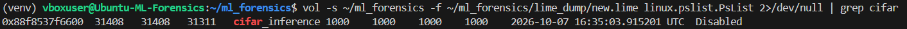
  <br>
  <em>Volatility pslist plugin locating the frozen cifar_inference process.</em>
</p>
<p align="center">
  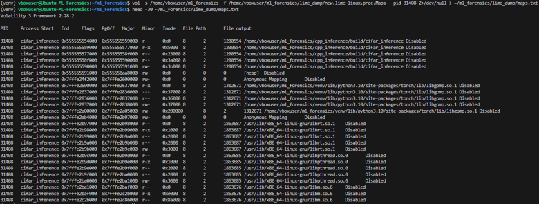
  <br>
  <em>proc.maps</em>
</p>

### In-Depth: Custom Plugin Engineering (Optional Reading)

*Note: This section provides a deep dive into the code and mechanics of our custom Volatility 3 plugin. If you are just looking for the results and output analysis, feel free to skip ahead to Section 6.*

To automate the manual pointer traversal performed in GDB, we engineered a custom Volatility 3 plugin (`torchmodel.TorchModel`, located in `ml_forensics/volatility_plugin/torchmodel.py`). Standard memory forensics tools cannot natively parse LibTorch data structures, so the plugin reconstructs the model by programmatically walking the C++ object hierarchy from the ground up.

The plugin was engineered using specific structure offsets verified for PyTorch 2.14.1 on an x86_64 Linux environment:

```python
# ---- offsets (PyTorch 2.14.1) -------------------------------------------
OBJ_TYPE = 0x40        # ivalue::Object::type_  (raw ClassType* is first word)
OBJ_SLOTS = 0x50       # ivalue::Object::slots_ (vector<IValue>: begin,end,cap)
IVALUE_SIZE = 16       # payload (8) + tag (low 4 bytes of 2nd word)
TAG_TENSOR = 0x1
TAG_OBJECT = 0x14

CT_NAME = 0x38         # ClassType::name_ -> std::string qualified name
CT_ATTRS = 0xE0        # ClassType::attributes_ (vector<ClassAttribute>)
ATTR_SIZE = 0x38       # sizeof(ClassAttribute): kind(8) type(16) name(32)
ATTR_KIND = 0x00
ATTR_NAME = 0x18

TI_STORAGE = 0x10      # TensorImpl::storage_ (-> StorageImpl*)
TI_NDIM = 0x38         # SizesAndStrides::size_
TI_SIZES = 0x40        # inline sizes[5]
TI_STRIDES = 0x68      # inline strides[5]
SI_DATA = 0x10         # StorageImpl::data_ptr
MAX_INLINE_DIMS = 5
```

The plugin operates across five core architectural phases:

#### 1. Vtable Scanning and ASLR Bypass
Because ASLR shifts process memory bases between runs, we tools cannot rely on hardcoded heap pointers. However, relative offsets within binary mappings remain constant. The virtual method table (`vtable`) for `c10::ivalue::Object` resides at a fixed offset within the executable binary.

Using `nm` on the `cifar_inference` executable, the static offset for `vtable for c10::ivalue::Object` was determined to be `0x3b7e8`. The virtual table pointer within an object instance points 16 bytes (`+0x10`) into the vtable structure (past the offset-to-top and RTTI typeinfo fields). The plugin dynamically locates candidate module roots by calculating this runtime address and scanning process VMAs:

```python
# Calculate runtime vtable pointer dynamically to bypass ASLR
exe = self.config["exe"]
bases = [v[0] for v in vmas if v[2].endswith(exe)]
if not bases:
    vollog.error("no VMA named %s", exe)
    return
vt = min(bases) + int(self.config["vtoff"], 0) + 0x10
vollog.info("scanning for ivalue::Object vtable %#x", vt)
cands = list(self._scan(mem.layer, vmas, struct.pack("<Q", vt)))
```

The `_scan` method reads memory in 1 MB chunks across the `[heap]` and anonymous read/write memory segments, searching for 8-byte aligned occurrences of the computed `vt` pointer:

```python
@staticmethod
def _scan(layer, vmas, needle: bytes) -> Iterator[int]:
    for start, end, name, prot in vmas:
        if not (name == "[heap]" or (name == "" and prot.startswith("rw"))):
            continue
        pos = start
        while pos < end:
            size = min(CHUNK, end - pos)
            data = layer.read(pos, size, pad=True)
            idx = data.find(needle)
            while idx != -1:
                if idx % 8 == 0:
                    yield pos + idx
                idx = data.find(needle, idx + 1)
            pos += size
```

This vtable target was corroborated in our interactive Volatility `volshell` session, where inspecting the root module at address `0x555558a33b20` confirmed the first quadword was `0x00005555558f7f8` (`<_ZTVN3c106ivalue6ObjectE+16>`).

<p align="center">
  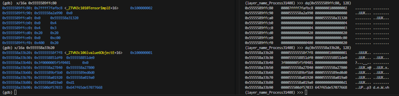
  <br>
  <em>Volshell interactive session verifying the vtable offset and root module address.</em>
</p>

#### 2. Object Validation and Root Module Isolation
Once we spot candidate objects on the heap, we have to validate them against LibTorch's internal invariants to filter out stale or uninitialized heap garbage. The plugin inspects the candidate object's class metadata and vector allocations:

```python
@staticmethod
def _parse_module(mem: Mem, obj: int) -> Dict:
    ct = mem.u64(obj + OBJ_TYPE)
    cls = mem.stdstr(ct + CT_NAME)
    if not cls.startswith("__torch__"):
        raise ValueError("not a TorchScript class")
    sb, se = mem.u64(obj + OBJ_SLOTS), mem.u64(obj + OBJ_SLOTS + 8)
    if se < sb or (se - sb) % IVALUE_SIZE or (se - sb) // IVALUE_SIZE > 4096:
        raise ValueError("bad slots_")
    nslots = (se - sb) // IVALUE_SIZE
    ab, ae = mem.u64(ct + CT_ATTRS), mem.u64(ct + CT_ATTRS + 8)
    if ae < ab or (ae - ab) % ATTR_SIZE or (ae - ab) // ATTR_SIZE != nslots:
        raise ValueError("attributes_/slots_ mismatch")
```

The validation checks three criteria:
* Follows the `type_` pointer at offset `+0x40` to the `c10::ClassType` structure, reading the qualified class name at `+0x38` to confirm it starts with `"__torch__"`.
* Inspects the `slots_` array bounds (`std::vector<c10::IValue>`) at `+0x50` to verify length alignment to `IVALUE_SIZE` (16 bytes).
* Verifies that the allocated slot count (`nslots`) precisely matches the attribute count defined in `c10::ClassType::attributes_` at offset `+0xE0`.

To differentiate the root model from submodules (e.g., `conv1`, `conv2`), the plugin collects all child module pointers referenced in slot attributes. The true root model is isolated as the candidate object that is never referenced as a child of another module:

```python
children = set()
valid = []
for c in cands:
    kids = self._child_objects(mem, c)
    if kids or self._try(mem, c):
        valid.append(c)
        children.update(kids)
roots = [c for c in valid if c not in children]
```

#### 3. Slot Traversal and Tag Masking
Each `c10::IValue` slot occupies 16 bytes, structured as an 8-byte payload followed by an 8-byte word storing the internal type tag in its lower 32 bits. Alongside the slots, the plugin reads `ClassType::attributes_` (`ATTR_SIZE = 0x38`) to pair each slot with its variable name (`+0x18`).

```python
slots = []
for i in range(nslots):
    payload = mem.u64(sb + IVALUE_SIZE * i)
    tag = mem.u32(sb + IVALUE_SIZE * i + 8)
    a = ab + ATTR_SIZE * i
    slots.append(
        {
            "index": i,
            "name": mem.stdstr(a + ATTR_NAME),
            "kind": ATTR_KINDS.get(mem.u64(a + ATTR_KIND) & 0xFFFFFFFF, "?"),
            "tag": tag,
            "payload": payload,
        }
    )
```

During recursive tree traversal (`_build`), the plugin inspects the tag:
* `TAG_OBJECT` (`0x14`): Identifies a submodule payload, prompting a recursive call to traverse that nested module layer.
* `TAG_TENSOR` (`0x1`): Identifies a tensor payload, directing the plugin to parse weight and bias metadata.

#### 4. Tensor Metadata Parsing and Weight Buffer Resolution
When a tensor payload is detected, the plugin resolves its `c10::TensorImpl` structure to extract multidimensional shape and memory locations:

```python
@staticmethod
def _parse_tensor(mem: Mem, t: int) -> Dict:
    nd = mem.u64(t + TI_NDIM)
    if nd > MAX_INLINE_DIMS:
        raise ValueError("ndim %d not stored inline" % nd)
    sizes = [mem.s64(t + TI_SIZES + 8 * i) for i in range(nd)]
    strides = [mem.s64(t + TI_STRIDES + 8 * i) for i in range(nd)]
    storage = mem.u64(t + TI_STORAGE)
    data = mem.u64(storage + SI_DATA)
    numel = 1
    for s in sizes:
        numel *= s
    exp, acc = [], 1
    for s in reversed(sizes):
        exp.append(acc)
        acc *= max(s, 1)
    return {
        "addr": t,
        "sizes": sizes,
        "strides": strides,
        "contiguous": strides == list(reversed(exp)),
        "data": data,
        "numel": numel,
    }
```

* **Dimensions and Strides:** Reads the dimension count (`TI_NDIM`) at `+0x38`, extracting inline `sizes` at `+0x40` and `strides` at `+0x68`.
* **Data Pointer Resolution:** Reads the `storage_` pointer at `+0x10` to navigate to `c10::StorageImpl`, then extracts `data_ptr` at offset `+0x10` (`SI_DATA`) to locate the contiguous raw floating-point buffer in memory.
* **Payload Calculation:** Calculates total elements (`numel`), yielding the required byte size (`numel * 4` for 32-bit floats).

#### 5. In-Memory NumPy Serialization
To carve weights in a portable format without requiring NumPy inside the Volatility runtime environment, the plugin constructs standard NumPy `.npy` (v1.0) binary files directly from raw memory bytes:

```python
def npy_bytes(raw: bytes, shape) -> bytes:
    """Minimal .npy (v1.0) writer for little-endian float32."""
    dims = ", ".join(str(s) for s in shape) + ("," if len(shape) == 1 else "")
    header = "{'descr': '<f4', 'fortran_order': False, 'shape': (%s), }" % dims
    pad = (64 - (10 + len(header) + 1) % 64) % 64
    header += " " * pad + "\n"
    return b"\x93NUMPY\x01\x00" + struct.pack("<H", len(header)) + header.encode("latin1") + raw
```

When invoked with `--dump`, `_dump_tensor` reads `numel * 4` raw bytes directly from the process layer and writes the `.npy` file to disk for each discovered tensor.

### Automated Model Extraction
With the `torchmodel` plugin built to navigate the C++ memory offsets, we execute it against the LiME memory image. Passing the `--dump` flag commands the plugin to map the network topology, write out `pid31408.architecture.json`, and carve every weight and bias tensor to disk:

```bash
vol -s ~/ml_forensics -p ~/ml_forensics/volatility_plugin -f ~/ml_forensics/lime_dump/new.lime torchmodel.TorchModel --pid 31408 --dump
```

<p align="center">
  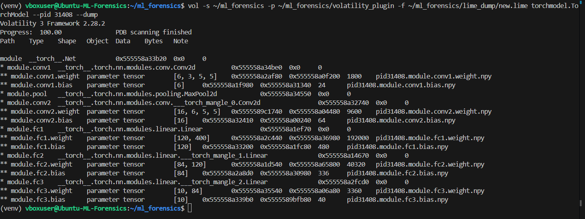
  <br>
  <em>Volatility 3 executing the custom torchmodel plugin, scanning the process heap, enumerating all network layers, and extracting tensor weights to disk.</em>
</p>

As shown in the output, the plugin successfully resolved the root module at address `0x555558a33b20` and recursively traversed every child module, outputting paths, data types, tensor dimensions, object pointers, data addresses, and byte sizes.

## 6. Output Analysis and Verification
Running our automated plugin carves the entire model out of the physical memory dump and reconstructs both the model architecture and its parameter weights. All extracted files are neatly organized under the `ml_forensics/output/` directory.

### Architecture Topology Reconstruction
You can inspect the `ml_forensics/output/` directory to find:
* `pid31408.architecture.json`: The reconstructed computational graph topology, providing an exact forensic representation of the neural network recovered from the heap slots. Not only does this reveal the hierarchical nesting from the root class through its submodules, but it also reconstructs the model's forward-pass execution flow. It confirms kernel and linear dimensions, and records the virtual addresses of both metadata objects and raw data buffers.
* `.npy` weight files: The raw extracted weights and biases for each layer (e.g., `pid31408.module.conv1.weight.npy`).

### Weight Verification and Memory Proof
To demonstrate that the recovered `.npy` files represent authentic model parameters rather than uninitialized memory, we verify the dumped arrays using Python and NumPy:

```bash
python3 -c "import numpy as np; w = np.load('pid31408.module.conv1.weight.npy'); print(f'Shape: {w.shape}'); print(f'First 5 weights: {w[0,0,0,:5]}')"
```

The command yields the exact dimensions and floating-point parameters:

```text
Shape: (6, 3, 5, 5)
First 5 weights: [-0.00444644  0.01641797 -0.04247967 -0.10649204 -0.16449124]
```

<p align="center">
  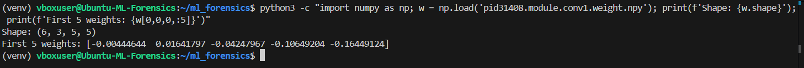
  <br>
  <em>Independent verification of the extracted conv1 weight tensor in Python, confirming expected dimensions and valid IEEE 754 float values.</em>
</p>

### Ground Truth Validation
While the standalone verification above confirms we extracted valid tensors, we can go one step further to definitively prove the scientific accuracy of our extraction. Because we trained the original PyTorch model in Step 1, we possess the "Ground Truth". By loading the original `models/cifar10_custom_cnn.pt` file and comparing it directly to the `.npy` files carved from the memory dump, we can verify if the memory forensics recovered the exact proprietary network. 

Running our custom validation script iterates through every extracted `.npy` tensor and compares it byte-for-byte against the original PyTorch model layers:

<p align="center">
  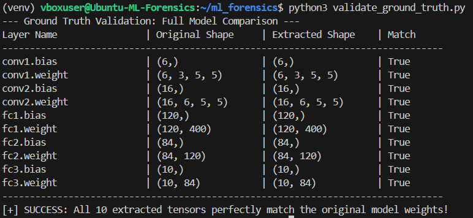
  <br>
  <em>A full validation scan cross-referencing every carved tensor against the original PyTorch model, proving a 100% exact extraction of the entire architecture.</em>
</p>

#### End-to-End Forensic Integrity
This proves that our entire workflow holds up from start to finish:
1. **Dynamic Analysis (GDB):** During live process execution, memory examination of `conv1` confirmed the base address and float patterns.
2. **Static Snapshot Verification (`volshell`):** Inspection of the raw LiME snapshot in `volshell` verified identical pointers (`0x555558a33b20`, `0x5555589ffc80`) and structure layouts preserved in physical memory.
3. **Automated Volatility 3 Extraction (`torchmodel`):** The plugin autonomously located the vtable, traversed the `slots_` array, resolved `c10::StorageImpl::data_ptr`, and wrote out `.npy` files.
4. **Binary Validation:** Loading the extracted `.npy` files confirmed an exact match with the floating-point values residing in the target process.
5. **Ground Truth Validation:** Direct comparison against the original source model proved flawless, lossless reconstruction of every parameter.

## Wrapping Up
 We successfully dumped a machine learning model out of a live C++ production environment. By manually mapping out the `c10::ivalue::Object`, `c10::TensorImpl`, and `c10::StorageImpl` hierarchies in GDB, we were able to write a custom Volatility plugin that bypasses ASLR, recovers the network topology (the forward-pass code), and carves out the exact tensor weights—all without needing debug symbols or the original application source code. 

> **AI Assistance Disclaimer:**
> *This project was developed with the assistance of AI models, including Google Gemini and Anthropic Claude. These tools were used to help draft this README, write and refine the codebase, analyze the forensic memory results, and serve as educational aids in understanding the LibTorch memory structures and Volatility.*
